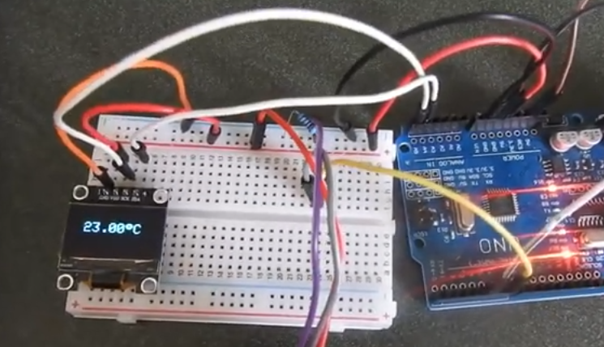
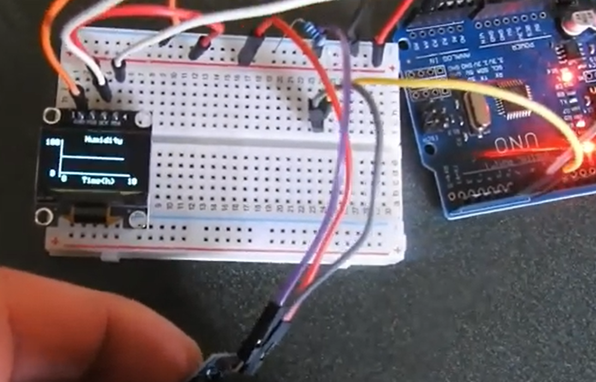

# Arduino Temperature Graph Project

## Description
This project measures temperature using an Arduino and displays the data in real-time graphs on an OLED display.

## Features
- Real-time temperature and humidity measurement
- Graph visualization on an OLED display

## Hardware Used
- Arduino Uno 
- DHT11 or DHT22 temperature sensor
- OLED display 
- Breadboard and jumper wires

